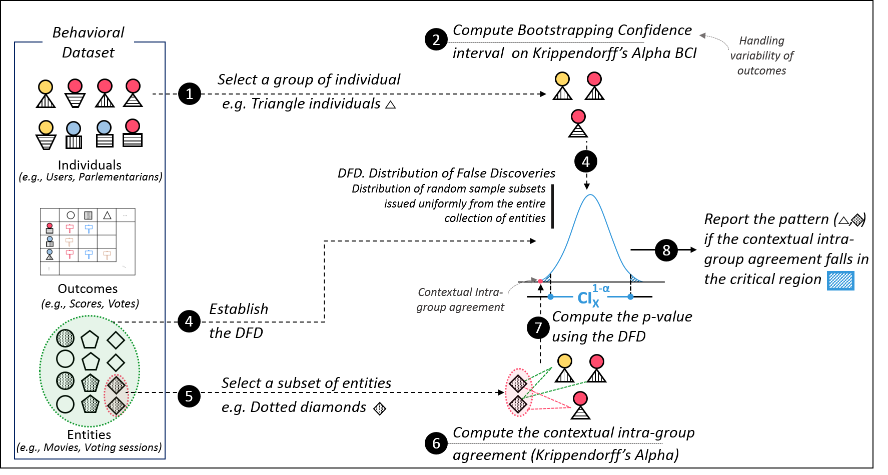

# Deviant
This repository contains materials (Implementation and Experiments) concerning the paper in review: "DEvIANT : Discovering statistically significant exceptional (dis-)agreement within groups"
This repository contains the materials concerning the paper in review: Identifying exceptional (dis)agreement between groups. It contains:
1. **Deviant-Code**: includes all the python scripts of the framework Deviant.
2. **Experiments_Scripts_and_Results**: includes all experiments reported in the paper (quantitative and qualitative) as well as the set of scripts used to generate the experiments.
3. **Datasets**: Contains the behavioral datasets used for the qualitative and quantitative experiments reported in the paper. 
4. **Example**: Contain an example of an input parameter file which allows to launch the method and uncover exceptional (dis-)agreement within groups.  

Below we give the method overview. Note that ```DEvIANT``` stands for Discovering statistically significant Exceptional contextual Intra-group Agreement paTterns.
  &nbsp;

> ```DEvIANT``` short description, In a nutshell, ```DEvIANT``` starts by forming groups of individuals ___(1)___ by enumerating conditions/restrictions on the description attributes of individuals. Next, ....
 
  &nbsp;