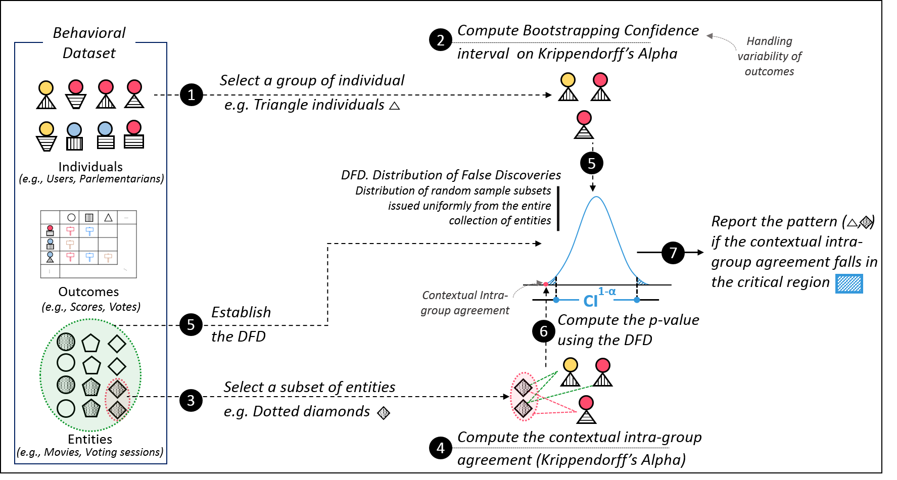

# DEvIANT
This repository contains materials (Implementation and Experiments) concerning the paper in review: "DEvIANT : Discovering statistically significant exceptional (dis-)agreement within groups"
This repository contains the materials concerning the paper in review: Identifying exceptional (dis)agreement between groups. It contains:
1. **Deviant-Code**: includes all the python scripts of the framework Deviant. Please run the scripts using Python 2.7 (we are so old fashioned :-) ) 
2. **Experiments_Scripts_and_Results**: includes all experiments reported in the paper (quantitative and qualitative) as well as the set of scripts used to generate the experiments.
3. **Datasets**: Contains the behavioral datasets used for the qualitative and quantitative experiments reported in the paper. 
4. **Example**: Contain an example of an input parameter file which allows to launch the method and uncover exceptional (dis-)agreement within groups.  

Below we give the method overview. Note that ```DEvIANT``` stands for Discovering statistically significant Exceptional contextual Intra-group Agreement paTterns.
  &nbsp;

> ```DEvIANT``` is an exceptional model mining technique which, given a behavioral dataset, mines for statistically significant exceptional (dis-)agreement within groups. The patterns returned by ```DEvIANT``` are of the form ```(g,c)``` where ```g``` is a group (reviewers) of individuals and ```c``` a context characeterizing a subset of entities (reviewees). In a nutshell, ```DEvIANT``` starts by forming groups of individuals ___(1)___ by enumerating conditions/restrictions on the descriptive attributes of individuals. Next, ___(2)___  ```DEvIANT``` computes the bootstraping confidence interval to handle variablity of outcomes of the considered group. Subsequently, ___(3)___ ```DEvIANT``` selects a context by enumerating conditions/restrictions on the descriptive attributes of entities handing over a subset of entities. For this subset of entities, ___(4)___ the corresponding contextual intra-group agreement is computed by using Krippendorff's Alpha. In order to evaluate how significant is the deviation from the expected intra-group agreement by chance, ___(5)___  ```DEvIANT``` establishes the Distribution of False Discoveries, dubbed DFD. The DFD corresponds to the distribution of Krippendorff's Alpha observed over subsets randomly and uniformly issued from the collections of subsets of entities having equal cardinality to the subset covered by the current context. The DFD allows to determine if the observed intra-group agreement occurs due to chance only (a baseline finding) or is significant enough (considering some critical value alpha). If ___(6)___  the observed contextual intra-group agreement falls within the critical region, this means that the finding is significant and hence is reported in the returned resultr set ___(7)___ .
 
  &nbsp;
  
### Qualitative experiments 
In order to launch the algorithm ```DEvIANT``` to read a behavioral dataset and returns a set of relevant exceptional (dis-)agreement patterns, a configuration file need to be specified to the method which structure is given below:  

```
{
	"objects_file":<entities collection file path>,
	"individuals_file":<individuals collection file path>,
	"reviews_file":<outcomes collection file path>,
	"delimiter":<delimiter used in the input csv file> (e.g. "\t"),

	"nb_objects":<number of entities to consider> (e.g.50000000),
	"nb_individuals":<number of individuals to consider> (e.g.5000000),

	"arrayHeader":<the set of attributes which values are of the form of an array (usually HMT attributes> (e.g. ["PROCEDURE_SUBJECT"]),
	"numericHeader":<the set of attributes which values are numerical (e.g. ["VOTE_DATE","EU_MEMBER_SINCE"]),
	"vector_of_outcome":<the structure of the outcomes vector> (e.g. if null all the attributes in the outcomes file are considered as elements depicting the action of an individual over an entity),
	"description_attributes_objects":<the descriptive attributes to consider for entities>, (e.g.[["PROCEDURE_SUBJECT", "themes"],["VOTE_DATE","numeric"],["COMMITTEE","simple"]]),
	"description_attributes_individuals":<the descriptive attributes to consider for individuals>, (e.g.[["EU_MEMBER_SINCE", "numeric"],["CURRENCY", "simple"],["SCHENGEN_MEMBER", "simple"],["COUNTRY", "simple"],["GROUPE_ID", "simple"],["NATIONAL_PARTY", "simple"]])

	"threshold_objects":<the minimum entities support size threshold> (e.g. 40),
	"threshold_individuals":<the minimum individuals support size threshold> (e.g. 10),
	"threshold_quality":<the critical value alpha> (e.g. 0.05),
	

	"quality_measure":"BOTH", <For now, this parameter need to be fixed to BOTH even if it allows to consider one tail tests>
	"algorithm":"P_VALUE_PEERS", <For now, this parameter need to be fixed to P_VALUE_PEERS. if fixed to COMMON_PEERS it performs a common exceptional model mining task where the contextual intra-group agreement is compared to the overall one and reported if this comparison leads to a distance greater than the threshold_quality>

	"results_destination":<yielded patterns results file path"> (e.g. .//results.csv")
	"detailed_results_destination": <yielded patterns additional results directory path - such as the context and groups informations> (e.g.".//DetailedResults//")
}
```

Once the configuration file is defined it can be executed using the command below.

```
python  .//Deviant-Code//main.py <configuration file path> -q
```

Other options are availableand enables to modify the parameters specified in the configuration file. All these elements are specified in the documentation of the main script. For more information about the available options please run:

```
python .//Deviant-Code//main.py -h
```

The script allows also to launch performance experiments, examples of such commands for each benchmark dataset are given in Experiments_Scripts_and_Results.py. 

### Version
1.0.0

  
### Corresponding Authors
For additional informations please contact: BELFODIL Adnene `adnene.belfodil@gmail.com`